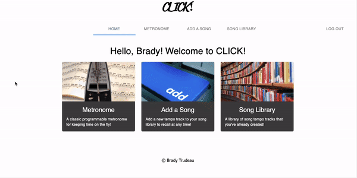

# CLICK! METRONOME APP

## Description

_Duration: 2 Weeks_

CLICK! was created due to a need for a flexible and reliable metronome for musicians of all different skill levels.
As a guy who has spent the majority of his life playing music, a good metronome is one of the most important tools in my toolbelt. The CLICK! App allows the user the following:

1. Classic metronome with adjustable bpm
2. Add Song feature to save multiple tempo tracks as different tracks
3. Song Library feature to recall saved tempo tracks
4. Adjustable bpm, time signature, accent tone (the '1' of each measure), and regular tone. 
5. Tap Tempo button to 'tap' out the tempo of your song

### Prerequisites

To run this app, make sure you have the following installed on your computer:

- Node.js
- Postgres
- Nodemon

## Database Setup

- Create a new database called `click-app`
- Run the SQL Query outlined in the database.sql file
- Note: If you would like to use a different database name, update the database name in `server/modules/pool.js`

## Installation

- Open this repo in your editor of choice and run the `npm install` in your terminal
- `npm run server` in your terminal
- `npm run client` in your terminal
- Note: The `npm run client` command will automatically open up a new browser tab for you!

## Built With

- Node
- Express
- React
- Redux
- Sagas
- PostgreSQL
- Passport
- Material UI

## Acknowledgement
HUGE thanks to Edan, dEv, and Casie for all of their fantastic instruction, wisdom, and continued support! Also, shoutout to [Prime Digital Academy](www.primeacademy.io) who gave me the opportunity to create this app. And last (but certainly not least), shoutout to all of my family in the Tarjan cohort for being great friends and helping me get through this fun and exciting journey! SWING SWING!

## Support
If you have suggestions or issues, please email me at [bradytrudeau@gmail.com](www.google.com)